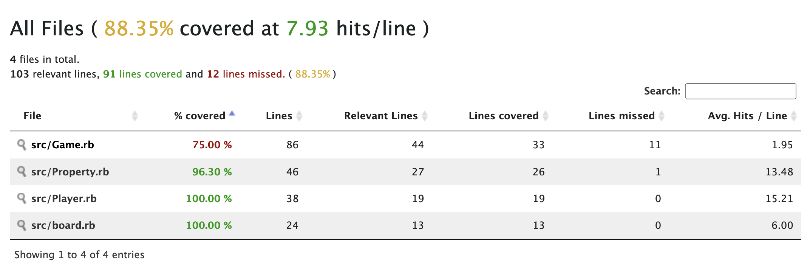

---

# Pronto Technical assessment


---
## READ.ME File

## Install Ruby (Version 2.6.10)

Make sure Ruby is installed on your system. The recommended version for this project is Ruby **3.0** or above.

### Installation on macOS/Linux
```
# Using Homebrew for macOS
brew install ruby
```
Verify Ruby installation:
```
ruby -v
```

---

## Install Bundler ( -v 2.4.22)

I used this specific version of bundler for this project, to manage my gems
```
gem install bundler -v 2.4.22
```

Verify Bundler installation:
```
bundle -v
```

---

## Install Git

Git is required for version control. You can install Git via:

### Installation on macOS/Linux
```
# Using Homebrew on macOS
brew install git
```

## How to Run the Program


### 1. Clone the Repository
```
git clone https://github.com/nidhi-peddisetty/pronto_project.git
cd pronto_project
```


### 3.Code location on Git - Branch : feature/pronto_test
 https://github.com/nidhi-peddisetty/pronto_project/tree/feature/pronto_test
### 3. Running the Program
Run the Ruby program:

```
ruby main.rb
```
## Game rules and assumptions

- **IDE**: RubyMine is used to develop the code.
- **Operating System**:  I did this project on MacOS
- **Game Rules**:
    1. Assuming player pays entirety of his money to the owner before becoming bankrupt and takes the place
    2. Assuming players are defined before starting the game in main.rb
    3. Specify additional game rolls files explicitly in main.rb

---

## Specs - Installed RSpec Gem

This project uses the **RSpec** gem for testing.

```
gem install rspec
```

### How to Run Specs
To run the tests using RSpec:
Navigate to spec folder and use rspec command to run all the tests in the directory

```
rspec 
```

To run Individual tests in the project:
Navigate to spec folder and use the below command:

```
rspec test_name.rb
```

---

## Coverage - Installed SimpleCov Gem

This project uses **SimpleCov** to generate test coverage reports.

### How to Generate Coverage Report using simplecov
After running the tests with RSpec, a coverage report will be generated. To view the coverage:

1. Run the tests with RSpec as described above, it will generate a coverage report in the coverage directory
2. Open `coverage/index.html` in a web browser to see the detailed coverage report.

```
gem install simplecov
bundle install
```
```
cd spec
rspec
```
